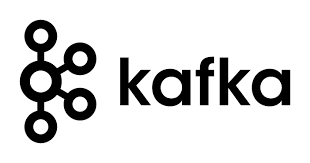

# docker-kafka
Boilerplate for kafka and zookeeper docker containers

---

# What is event streaming by Kafka?

Apache Kafka is a distributed event store and stream-processing platform. It is an open-source system developed by the Apache Software Foundation written in Java and Scala. The project aims to provide a unified, high-throughput, low-latency platform for handling real-time data feeds. Kafka can connect to external systems (for data import/export) via Kafka Connect, and provides the Kafka Streams libraries for stream processing applications. Kafka uses a binary TCP-based protocol that is optimized for efficiency and relies on a "message set" abstraction that naturally groups messages together to reduce the overhead of the network roundtrip. This "leads to larger network packets, larger sequential disk operations, contiguous memory blocks [...] which allows Kafka to turn a bursty stream of random message writes into linear writes."

[https://en.wikipedia.org/wiki/Apache_Kafka](https://en.wikipedia.org/wiki/Apache_Kafka)
